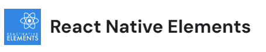

1. **React Native Elements:**

   

   - 官方网站: [React Native Elements](https://reactnativeelements.com/docs/)
   - 中文文档: 暂时没有官方中文文档
   - 特性：
     - 提供了一组常用的 UI 元素，如按钮、卡片、图标等。
     - 易于使用，支持自定义主题。
   - 优点：
     - 快速入门，适合小型项目。
     - 提供了许多预先设计好的组件。
   - 缺点：
     - 定制性相对较低，可能不适用于高度定制化的设计。
     - 样式主题的修改可能有一些限制。

2. **NativeBase:**
   
   
   
   - 官方网站: [NativeBase](https://nativebase.io/)
   - 中文文档: 暂时没有官方中文文档
   - 特性：
     - 提供了一套原生风格的跨平台 UI 组件。
     - 支持主题定制，具有良好的可扩展性。
   - 优点：
     - 提供了大量的原生风格组件。
     - 支持轻松的主题自定义。
   - 缺点：
     - 安装和配置相对复杂，可能需要处理一些原生代码。
     - 在一些旧版本中可能存在性能问题。
   
3. **Ant Design Mobile RN:**
   
   
   
   - 官方网站: [Ant Design Mobile RN](https://rn.mobile.ant.design/)
   - 中文文档: [Ant Design Mobile RN 中文文档](https://rn.mobile.ant.design/)
   - 特性：
     - 移动端版本的Ant Design，提供了丰富的React Native组件。
     - 遵循Ant Design设计原则，有统一的风格。
   - 优点：
     - 提供了一致的设计语言。
     - 支持丰富的组件。
   - 缺点：
     - 文件体积相对较大。
     - 需要额外的配置来适应项目的定制需求。
   
4. **Shoutem UI:**
   
   
   
   - 官方网站: [Shoutem UI Toolkit](https://shoutem.github.io/docs/ui-toolkit/introduction)
   - 中文文档: 暂时没有官方中文文档
   - 特性：
     - 提供了一组功能强大的React Native UI组件。
     - 包含主题编辑器，支持主题自定义。
   - 优点：
     - 提供了一些高度定制化的组件。
     - 主题编辑器允许灵活调整外观。
   - 缺点：
     - 相对较少的社区支持和更新频率。
     - 文档相对简化，可能需要更多的自行探索。
   
5. **React Native Paper:**
   
   
   
   - 官方网站: [React Native Paper](https://callstack.github.io/react-native-paper/)
   - 中文文档: 暂时没有官方中文文档
   - 特性：
     - 基于Material Design设计原则，提供了Material风格的React Native组件。
     - 具有漂亮的设计和动画效果。
   - 优点：
     - 提供了一组符合Material Design的高质量组件。
     - 文档清晰，社区支持较好。
   - 缺点：
     - 相对于其他库，提供的组件数量可能较少。
     - 某些组件可能不适用于所有项目的设计需求。

在选择组件库时，综合考虑这些因素可以更好地满足你项目的需求。请注意，对于某些库，中文文档可能没有提供或者相对有限，因此你可能需要参考英文文档和示例。
